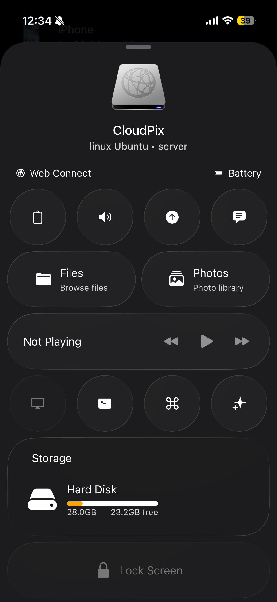

# HomeCloud: Make your devices work together, for you.

    <picture>
        
    </picture>

HomeCloud is a companion app for accessing and controlling your devices and storage from anywhere without relying on third-party cloud storage services. Transfer files, stream, browse and edit photos, and manage your data directly. HomeCloud is completely free and open-source, built with privacy at its core and secured by end-to-end encryption, ensuring your data never leaves your devices. Enjoy a seamless multi-device experience with features like media playback and volume control, clipboard sharing, and more so you can stay focused without juggling between devices.

## How it works

- HomeCloud connects your devices directly using peer-to-peer networking. Local devices discover each other via mDNS, and remote connections are established securely over UDP without routing your data through cloud storage.
- Devices maintain their identity using on-device public key cryptography, ensuring your data stays private, secure, and fully under your control.
- HomeCloud uses a authentication and broker service for device list syncing and connection setups when needed, your actual data is always transferred peer-to-peer and never reaches our servers.

## Features

- **File Access:** Browse, download, open and edit files remotely.
- **Photo Library:** View and manage your photos and camera roll across devices, with support for Apple-specific formats like HEIC.
- **Media Control:** Control media playback (for desktop) and volume remotely.
- **Copy, paste anywhere:** Access your clipboard across devices.
- **Send Files, Texts and Links:** Instantly send texts, links, and files with no size limits.
- **Works Offline:** Devices can find each other automatically on your local network, no internet needed.
- **Always Connected:** Devices can also connect directly over the internet without relays, preserving privacy and performance.
- **Free and open-sourced:** Data moves directly across devices, giving you better privacy and reducing our server costs, its a win-win.

For further details of each feature, please see our documentation page. To receive the latest updates, get help with HomeCloud, and join the community, please visit one of our communication channels.

## Get started

Download and install HomeCloud on your phones, laptops, iPads.

- **Desktop**: [GitHub Releases](https://github.com/asrient/HomeCloud/releases/latest/) available for macOS (Intel + Apple Silicon), Windows (Linux coming soon).
- **Mobile**: Coming soon to Google Play and App Store.

See [Get Started](docs/Help/get-started.md) to know more about how to setup and use HomeCloud.

## Background and direction

We love Apple's continuity ecosystem, it is seamless and productive, but they lack interoperability with non-apple devices. People often end up relying on cloud storage services for simple things like file transfers. This project was born as a way to bridge the gap and bring similar experiences to every major platform, as well as to expand and experiment more into even advanced connected experiences. 

The core of our platform is our network stack, that supports local discovery and connections over wifi as well as remote direct connections without needing a relay in between. This makes things like E2E encryption, large file transfers possible without a need for heavy infra at backend. 

We keep experimenting with new ways to make your devices work together better for you, do check out our roadmap to keep track of all the exciting things we are working on and feel free to add your suggestions in discussions if you have anything in mind.

## Contributing

We can always use your help and your contributions are very welcome! Here's how you can help:

- **Report bugs** or **suggest features** via [GitHub Issues](https://github.com/asrient/HomeCloud/issues)
- **Submit PRs** — check for issues labeled `good first issue`
- **Test the app** on your devices and share your experience
- **Star the repo** if you find it useful ⭐

For development setup and architecture details, see [Development Guide](docs/Development/Overview.md).

## License

MIT
