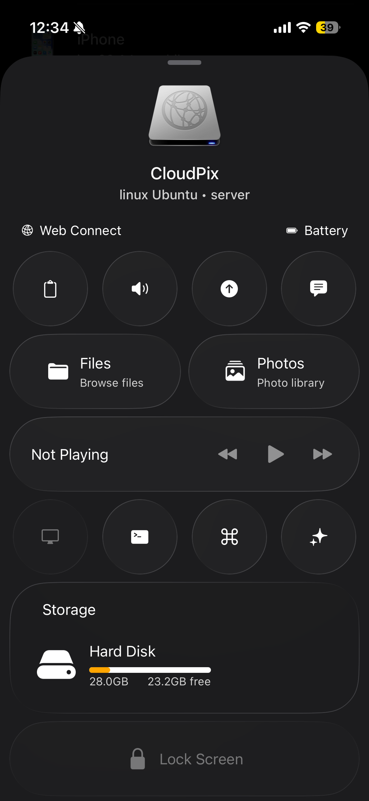

# HomeCloud

    <picture>
        
    </picture>

    <strong>Access and control all your devices from anywhere.</strong> 
    Files, photos, clipboard, screen, terminal, over any network.

    <a href="https://asrient.com/homecloud/download">Download</a> · <a href="https://asrient.com/homecloud/docs/help/get-started">Get Started</a> · <a href="https://github.com/asrient/HomeCloud/issues">Report Bug</a>

---

HomeCloud is a free, open-source device bridge that connects your phones and computers across any network. Unlike tools that only work on the same WiFi (KDE Connect, LocalSend), HomeCloud connects your devices over the internet too, while staying fully peer-to-peer, no VPN setups needed.

**What HomeCloud means for you:**

- 🔁 AirDrop that works with any platform including Windows, Android, macOS, iOS.
- 🐧 KDE Connect that actually connects, not just on same WiFi. With or without internet.
- 🛠️ Give AI agents access to your devices via MCP: files, screen, terminal, photos.
- 🤖 Automations and workflows for power users.

## Features

| Feature | Description |
|---------|-------------|
| 📁 **File Access** | Browse, download, open, and edit files on any connected device |
| 📸 **Photo Library** | View and manage phone photos and camera roll from your computer (including HEIC) |
| 📋 **Clipboard Sync** | Copy on one device, paste on another — works across any OS |
| 📤 **Send Anything** | Send files, texts, and links instantly with no size limits |
| 🖥️ **Remote Screen** | View and control your devices remotely |
| 💻 **Terminal** | Open a terminal session to any connected device |
| 🎵 **Media Control** | Control desktop media playback and volume from your phone |
| 🤖 **AI Agents** | Run AI agent like Claude Code in the background and chat from any device. |
| ⚡ **Workflows** | Create and run automated tasks across your devices |

### What makes HomeCloud different

| | HomeCloud | KDE Connect | LocalSend |
|---|---|---|---|
| **Works over internet (P2P)** | ✅ | ❌ Same WiFi only | ❌ Same WiFi only |
| **Truly cross-platform** | macOS, Windows, iOS, Android (Linux soon) | Weak on Mac/iOS | All, but file transfer only |
| **File transfer** | ✅ | ✅ | ✅ |
| **Clipboard sync** | ✅ | ✅ | ✅ |
| **Remote screen** | ✅ | ❌ | ❌ |
| **Remote terminal** | ✅ | ❌ | ❌ |
| **Phone photos on desktop** | ✅ | ❌ | ❌ |
| **Workflows / automation** | ✅ | ❌ | ❌ |
| **No VPN or port forwarding** | ✅ | Needs VPN for remote | Needs VPN for remote |

## AI Agents

HomeCloud can also serve as the device layer for AI agents. Connect any AI agent or tool to your devices using industry-standard protocols:

- **MCP (Model Context Protocol):** Any MCP-compatible AI agent can get access to your device's files, photos, system info, and more through HomeCloud. Works with Claude, Copilot, and other MCP-enabled tools.
- **ACP (Agent Communication Protocol):** See and control AI agents running on any of your devices from anywhere - your phone, laptop, or tablet.

## How it works

- **Peer-to-peer networking.** Local devices discover each other via mDNS. Remote devices connect directly over UDP.
- **End-to-end encrypted.** Devices authenticate using on-device public key cryptography. Your data stays private and fully under your control.
- **Lightweight broker.** HomeCloud uses an authentication and broker service only for device discovery and connection setup. Your actual data is always transferred peer-to-peer and never reaches our servers.

## Get started

Download and install HomeCloud on your phones, laptops, and iPads.

- **Desktop**: [Download](https://asrient.com/homecloud/download) for macOS, Windows. Linux coming soon.
- **Mobile**: Currently in early testing - [Download](https://asrient.com/homecloud/download).
- **Server**: you can also run HomeCloud on your home server without a GUI - [learn more](https://asrient.com/homecloud/docs/help/server-setup).

See the [Get Started](https://asrient.com/homecloud/docs/help/get-started) for setup instructions.

## Why HomeCloud?

Most device bridge tool like KDE Connect, LocalSend, Sefirah breaks the moment you leave your home WiFi. People set up entire VPN infrastructure just to get clipboard sync working at the office or a coffee shop.

HomeCloud was built to work on **any network**, local or internet, while staying peer-to-peer. No VPN, no port forwarding, no firewall configs. It just connects.

But connectivity is just the foundation. HomeCloud also gives you things no other device bridge does: browse your phone's photo library from your computer, open remote terminal sessions, run automated workflows, and connect AI agents to your devices, all from anywhere, on any OS.

## Contributing

Contributions are welcome! Here's how you can help:

- **Report bugs** or **suggest features** via [GitHub Issues](https://github.com/asrient/HomeCloud/issues)
- **Test the app** on your devices and share your experience
- **Star the repo** if you find it useful ⭐

For development setup and architecture details, see the [Development Guide](docs/Development/Overview.md).

## License

MIT
