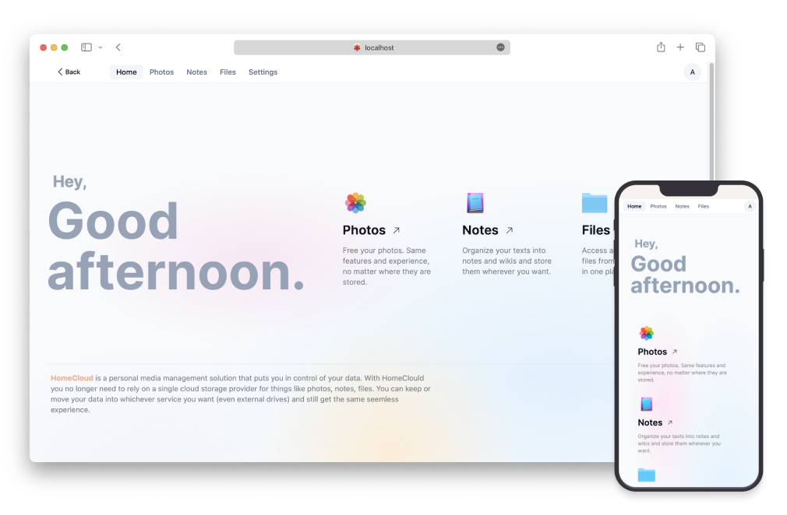

# HomeCloud

Homecloud is your personal digital content management app designed to streamline your digital life. It enables you to manage files, photos, notes, and more across all your storage devices and services. No more hassle of switching between different apps or sticking to a single storage provider.

## Features

- Multiple storage types support - Google Drive, Dropbox, WebDav, Local files.
- Specialized apps to manage Photos, Notes.
- No Sign-ups Required. All your data stays on your existing storage spaces. That means no signups, no subscriptions, no usage limits.

Learn more: [https://asrient.me/homecloud](https://asrient.me/homecloud). 

## Usage

HomeCloud is available both as Desktop app and a web version.

### HomeCloud Desktop

You can download the latest version from [releases](https://github.com/asrient/HomeCloud/releases/latest/). Available for MacOS (intel, Apple Silicon), Linux (.deb), Windows. Desktop app does not rely on the server version.

### HomeCloud Server

If you want to use the web version you can either self-host your own server instance or use the [Public Server instance](https://homecloud.asrient.me/) hosted by us.

- Docker images are available for self-hosting at [Docker Hub](https://hub.docker.com/r/asrient/homecloud), to learn more on how to install and setup follow the install doc.
- A publicly available instance of the server is available as well which currently runs on [Render](https://render.com/). Note that you might face a delay in loading the site for the first time due to render instances being suspended when not in use.

## Contributions

HomeCloud is very new, there's a lot to work on yet. Your feedback and suggestions would be very helpful on the way. Specially we ask you to share your experince with us if you have recently tried out HomeCloud.
You can help improve HomeCloud by reporting issues, suggestions [here](https://github.com/asrient/HomeCloud/issues) or by raising new PRs.
