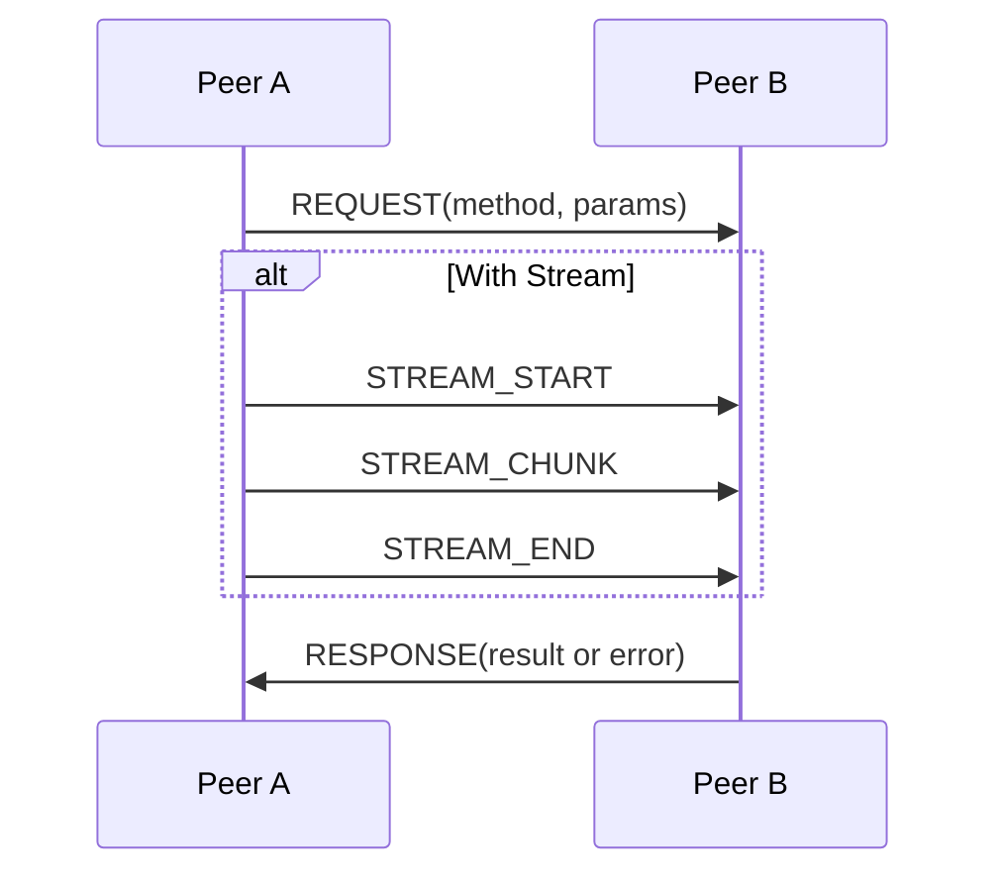

# RPC over WebRTC Specification

## Overview

This protocol defines a simple and efficient way to perform **RPC (Remote Procedure Calls)** over **WebRTC DataChannels**, with support for **streaming** data as part of parameters or results.

- Messages are **binary-framed**.
- Payloads are mostly **JSON**, except for binary streams.
- Designed for **low-overhead** and **stream-friendly** use cases.

---

## Message Framing

Each message consists of:

| Offset | Size (bytes) | Field          | Description |
|:------:|:------------:|:---------------|:------------|
| 0      | 1            | Type           | Message type (see below) |
| 1      | 1            | Flags          | Reserved for future use |
| 2      | 4            | Payload Length | Big-endian 32-bit integer |
| 6      | *n*          | Payload        | Payload data |

- **Type** defines the kind of message (Request, Response, Stream chunk, etc.).
- **Flags** is reserved (usually `0x01`) for now.
- **Payload Length** specifies the size of the payload.
- **Payload** format depends on the Type.

---

## Message Types

| Type ID | Type Name       | Purpose |
|:-------:|:----------------|:--------|
| `0x01`  | INIT             | Optional initialization handshake. |
| `0x02`  | REQUEST          | Call a remote method. |
| `0x03`  | RESPONSE         | Send back a result (success or error). |
| `0x04`  | ERROR            | Explicitly notify an error outside normal request/response. |
| `0x06`  | STREAM_START     | Signal start of a new stream. |
| `0x07`  | STREAM_CHUNK     | Transfer a chunk of stream data. |
| `0x08`  | STREAM_END       | Signal end of a stream. |
| `0x09`  | STREAM_CANCEL    | Cancel an ongoing stream transmission. |

---

## Message Payload Formats

### REQUEST

**Purpose:** Invoke a remote method.

Payload:

| Field | Type         | Description |
|:-----:|:------------:|:------------|
| Call ID | `uint32`   | Unique identifier for this call. |
| Method Name Length | `uint8` | Length of method name string. |
| Method Name | `utf8 bytes` | Name of the remote method. |
| Params Length | `uint32` | Length of JSON-encoded parameters. |
| Params | `utf8 bytes` | JSON-encoded array of parameters. |

- **Parameters** must be passed as a JSON Array `[]`.
- **Streams** are embedded by special objects `{ "__rpc_stream__": <stream_id> }` inside the JSON.

---

### RESPONSE

**Purpose:** Reply to a request.

Payload:

| Field | Type         | Description |
|:-----:|:------------:|:------------|
| Call ID | `uint32`   | The original Call ID from the request. |
| Status | `uint8`     | `0` = Success, `1` = Error. |
| Result Length | `uint32` | Length of the result payload. |
| Result | `utf8 bytes` | JSON-encoded result or error object. |

- If success (`Status == 0`), Result is JSON.
- If error (`Status == 1`), Result is a JSON error object.
- **Streams** inside the result are also wrapped with `{ "__rpc_stream__": <stream_id> }`.

---

### STREAM_START

**Purpose:** Announce beginning of a stream.

| Field | Type         | Description |
|:-----:|:------------:|:------------|
| Call ID | `uint32`   | Related call (optional, 0 if independent). |
| Stream ID | `uint32` | Unique ID assigned to this stream. |

---

### STREAM_CHUNK

**Purpose:** Send a piece of stream data.

| Field | Type         | Description |
|:-----:|:------------:|:------------|
| Stream ID | `uint32` | Target Stream ID. |
| Chunk | `bytes`      | Arbitrary data chunk. |

---

### STREAM_END

**Purpose:** Indicate the stream is finished.

| Field | Type         | Description |
|:-----:|:------------:|:------------|
| Stream ID | `uint32` | Target Stream ID. |

---

### STREAM_CANCEL

**Purpose:** Cancel a running stream.

| Field | Type         | Description |
|:-----:|:------------:|:------------|
| Stream ID | `uint32` | Target Stream ID. |

---

### ERROR

**Purpose:** Send unsolicited errors (outside request/response cycle).

| Field | Type         | Description |
|:-----:|:------------:|:------------|
| Error Length | `uint32` | Length of JSON error message. |
| Error | `utf8 bytes` | JSON error object. |

---

## Special Behavior: Handling Streams

- **Sending Streams:** 
  - User marks streams by wrapping with `{ "__rpc_stream__": id }`.
  - The actual stream data is sent later via STREAM_START + STREAM_CHUNK + STREAM_END.

- **Receiving Streams:**
  - When decoding parameters or results, if `{ "__rpc_stream__": id }` is found, an `RPCStream` object is created.
  - Stream objects must be **lazy** — only start reading when the user actually reads the stream.

- **Cancelling Streams:**
  - Either side can send STREAM_CANCEL to abort transmission.

---

## Sample Flows

### Basic RPC Call (No Streams)
```
Peer A                         Peer B
  |  -- REQUEST(method, params) --> |
  |                                 |
  |  <-- RESPONSE(result) ----------|
```

### RPC Call with Stream Parameter

```
Peer A                         Peer B
  |  -- REQUEST(method, [{ "__rpc_stream__": 123 }]) --> |
  |  -- STREAM_START(callId, 123) -->                    |
  |  -- STREAM_CHUNK(123, data...) -->                   |
  |  -- STREAM_END(123) -->                              |
  |                                                      |
  |  <-- RESPONSE(result) -----------------------------  |
```

### Error Flow

```
Peer A                         Peer B
  |  -- REQUEST(method, params) --> |
  |                                 |
  | <-- RESPONSE(error, status=1) --|
```

or

```
Peer A                          Peer B
  |                                  |
  | <-- ERROR("Something went wrong")|
```

### More Flows



```mermaid
flowchart TD
  A(Request) -->|callId| B{Peer B}
  B --> C[Run method]
  C --> D{Return result}
  D -->|Success| E[RESPONSE(success)]
  D -->|Error| F[RESPONSE(error)]
```
